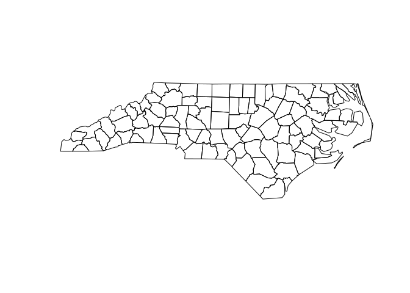

<!-- README.md is generated from README.Rmd. Please edit that file -->

# sfarrow: Read/Write Simple Feature Objects (`sf`) with ‘Apache’ ‘Arrow’

`sfarrow` is a package for reading and writing Parquet and Feather files
with `sf` objects using `arrow` in `R`.

Simple features are a popular format for representing spatial vector
data using `data.frames` and a list-like geometry column, implemented in
the `R` package [`sf`](https://r-spatial.github.io/sf/). Apache Parquet
files are an open-source, column-oriented data storage format
(<https://parquet.apache.org/>) which enable efficient read/writing for
large files. Parquet files are becoming popular across programming
languages and can be used in `R` using the package
[`arrow`](https://github.com/apache/arrow/).

The `sfarrow` implementation translates simple feature data objects
using well-known binary (WKB) format for geometries and reads/writes
Parquet/Feather files. A key goal of the package is for interoperability
of the files (particularly with Python `GeoPandas`), so coordinate
reference system information is maintained in a standard metadata format
(<https://github.com/geopandas/geo-arrow-spec>). Note to users: this
metadata format is not yet stable for production uses and may change in
the future.

## Installation

`sfarrow` is available through CRAN with:

``` r
install.packages('sfarrow')
```

or it can be installed from Github with:

``` r
devtools::install_github("wcjochem/sfarrow@main")
```

Load the library to begin using it.

``` r
library(sfarrow)
```

### `arrow` package

The installation requires the Arrow library which should be installed
with the `R` package `arrow` dependency. However, some systems may need
to follow additional steps to enable full support of that library.
Please refer to the `arrow`
[documentation](https://CRAN.R-project.org/package=arrow/vignettes/install.html).

## Basic usage

Reading Parquet data of spatial files created with Python `GeoPandas`.

``` r
# load Natural Earth low-res dataset. 
# Created in Python with geopandas.to_parquet()
path <- system.file("extdata", "world.parquet", package = "sfarrow")

world <- st_read_parquet(path)

world
#> Simple feature collection with 177 features and 5 fields
#> Geometry type: GEOMETRY
#> Dimension:     XY
#> Bounding box:  xmin: -180 ymin: -90 xmax: 180 ymax: 83.64513
#> Geodetic CRS:  WGS 84
#> First 10 features:
#>      pop_est     continent                     name iso_a3 gdp_md_est
#> 1     920938       Oceania                     Fiji    FJI  8.374e+03
#> 2   53950935        Africa                 Tanzania    TZA  1.506e+05
#> 3     603253        Africa                W. Sahara    ESH  9.065e+02
#> 4   35623680 North America                   Canada    CAN  1.674e+06
#> 5  326625791 North America United States of America    USA  1.856e+07
#> 6   18556698          Asia               Kazakhstan    KAZ  4.607e+05
#> 7   29748859          Asia               Uzbekistan    UZB  2.023e+05
#> 8    6909701       Oceania         Papua New Guinea    PNG  2.802e+04
#> 9  260580739          Asia                Indonesia    IDN  3.028e+06
#> 10  44293293 South America                Argentina    ARG  8.794e+05
#>                          geometry
#> 1  MULTIPOLYGON (((180 -16.067...
#> 2  POLYGON ((33.90371 -0.95, 3...
#> 3  POLYGON ((-8.66559 27.65643...
#> 4  MULTIPOLYGON (((-122.84 49,...
#> 5  MULTIPOLYGON (((-122.84 49,...
#> 6  POLYGON ((87.35997 49.21498...
#> 7  POLYGON ((55.96819 41.30864...
#> 8  MULTIPOLYGON (((141.0002 -2...
#> 9  MULTIPOLYGON (((141.0002 -2...
#> 10 MULTIPOLYGON (((-68.63401 -...
plot(sf::st_geometry(world))
```



Writing `sf` objects to Parquet format files. These Parquet files
created with `sfarrow` can be read within Python using `GeoPandas`.

``` r
nc <- sf::st_read(system.file("shape/nc.shp", package="sf"), quiet=TRUE)

st_write_parquet(obj=nc, dsn=file.path(tempdir(), "nc.parquet"))
#> Warning: This is an initial implementation of Parquet/Feather file support and
#> geo metadata. This is tracking version 0.1.0 of the metadata
#> (https://github.com/geopandas/geo-arrow-spec). This metadata
#> specification may change and does not yet make stability promises.  We
#> do not yet recommend using this in a production setting unless you are
#> able to rewrite your Parquet/Feather files.

# read back into R
nc_p <- st_read_parquet(file.path(tempdir(), "nc.parquet"))

nc_p
#> Simple feature collection with 100 features and 14 fields
#> Geometry type: MULTIPOLYGON
#> Dimension:     XY
#> Bounding box:  xmin: -84.32385 ymin: 33.88199 xmax: -75.45698 ymax: 36.58965
#> Geodetic CRS:  NAD27
#> First 10 features:
#>     AREA PERIMETER CNTY_ CNTY_ID        NAME  FIPS FIPSNO CRESS_ID BIR74 SID74
#> 1  0.114     1.442  1825    1825        Ashe 37009  37009        5  1091     1
#> 2  0.061     1.231  1827    1827   Alleghany 37005  37005        3   487     0
#> 3  0.143     1.630  1828    1828       Surry 37171  37171       86  3188     5
#> 4  0.070     2.968  1831    1831   Currituck 37053  37053       27   508     1
#> 5  0.153     2.206  1832    1832 Northampton 37131  37131       66  1421     9
#> 6  0.097     1.670  1833    1833    Hertford 37091  37091       46  1452     7
#> 7  0.062     1.547  1834    1834      Camden 37029  37029       15   286     0
#> 8  0.091     1.284  1835    1835       Gates 37073  37073       37   420     0
#> 9  0.118     1.421  1836    1836      Warren 37185  37185       93   968     4
#> 10 0.124     1.428  1837    1837      Stokes 37169  37169       85  1612     1
#>    NWBIR74 BIR79 SID79 NWBIR79                       geometry
#> 1       10  1364     0      19 MULTIPOLYGON (((-81.47276 3...
#> 2       10   542     3      12 MULTIPOLYGON (((-81.23989 3...
#> 3      208  3616     6     260 MULTIPOLYGON (((-80.45634 3...
#> 4      123   830     2     145 MULTIPOLYGON (((-76.00897 3...
#> 5     1066  1606     3    1197 MULTIPOLYGON (((-77.21767 3...
#> 6      954  1838     5    1237 MULTIPOLYGON (((-76.74506 3...
#> 7      115   350     2     139 MULTIPOLYGON (((-76.00897 3...
#> 8      254   594     2     371 MULTIPOLYGON (((-76.56251 3...
#> 9      748  1190     2     844 MULTIPOLYGON (((-78.30876 3...
#> 10     160  2038     5     176 MULTIPOLYGON (((-80.02567 3...
plot(sf::st_geometry(nc_p))
```


For additional examples please see the vignettes.

## Contributions

Contributions, questions, ideas, and issue reports are welcome. Please
raise an issue to discuss or submit a pull request.

## Acknowledgements

This work benefited from the work by developers in the GeoPandas, Arrow,
and r-spatial teams. Thank you to the teams for their excellent,
open-source work.
